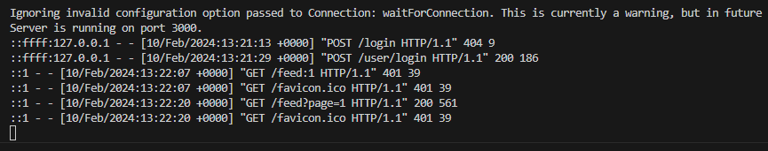

## FRONT-END

# File Structure
front-end/ 
|-- node_modules/ 
|-- build/ 
|-- public/ 
|-- src/ 
|   |-- App.css 
|   |-- App.js 
|   |-- App.test.js 
|   |-- http-common.js 
|   |-- index.css 
|   |-- index.js 
|   |-- service.js 
|   |-- app.css 
|-- package-lock.json 
|-- package.json 
|-- README.md 

## BACK-END

# File Structure

back-end/ 
|-- node_modules/ 
|-- resources/ 
|   |-- images/ 
|   |-- logs/ 
|   |-- xml/ 
|-- controllers/ 
|   |-- chatController.js 
|   |-- feedController.js 
|   |-- friendController.js 
|   |-- userController.js 
|-- models/ 
|   |-- chatModel.js 
|   |-- feedModel.js 
|   |-- friendModel.js 
|   |-- userModel.js 
|-- routes/ 
|   |-- routes.js 
|-- middleware/ 
|   |-- auth.js 
|-- server.js 
|-- .env 
|-- .gitignore 
|-- package-lock.json 
|-- package.json 
|-- README.md 

# create table

- user table

CREATE TABLE user (
    id VARCHAR(10) PRIMARY KEY,
    passwd VARCHAR(255) NOT NULL,
    name VARCHAR(50) NOT NULL,
    birthday DATE NOT NULL,
    gender TINYINT NOT NULL, #0:Male 1:Female
    create_dt TIMESTAMP DEFAULT CURRENT_TIMESTAMP,
    login_dt TIMESTAMP DEFAULT CURRENT_TIMESTAMP,
    picture_url VARCHAR(255) NOT NULL DEFAULT ''
);

- post table

CREATE TABLE post (
    id INT PRIMARY KEY AUTO_INCREMENT,
    user_id VARCHAR(10) NOT NULL,
    title VARCHAR(100) NOT NULL,
    content_url VARCHAR(255) DEFAULT '',
    scope TINYINT NOT NULL DEFAULT 0, #0:Public 1:Friends 2:Private
    create_dt TIMESTAMP DEFAULT CURRENT_TIMESTAMP,
    FOREIGN KEY (user_id) REFERENCES user(id) ON DELETE CASCADE
);

- comment table

CREATE TABLE comments (
    id INT PRIMARY KEY AUTO_INCREMENT,
    post_id INT NOT NULL,
    user_id VARCHAR(10),
    content VARCHAR(100) NOT NULL,
    create_dt TIMESTAMP DEFAULT CURRENT_TIMESTAMP,
    FOREIGN KEY (post_id) REFERENCES post(id) ON DELETE CASCADE,
    FOREIGN KEY (user_id) REFERENCES user(id) ON DELETE CASCADE
);

- tag table

CREATE TABLE tags (
    comment_id INT NOT NULL,
    user_id VARCHAR(10) NOT NULL,
    checking TINYINT NOT NULL DEFAULT 0, # 0:미확인, 1:확인
    create_dt TIMESTAMP DEFAULT CURRENT_TIMESTAMP,
    PRIMARY KEY (comment_id, user_id),
    FOREIGN KEY (comment_id) REFERENCES comment(id) ON DELETE CASCADE,
    FOREIGN KEY (user_id) REFERENCES user(id) ON DELETE CASCADE
);

- friend list table

CREATE TABLE friend_list (
    user_id VARCHAR(10) NOT NULL,
    friend_id VARCHAR(10) NOT NULL,
    create_dt TIMESTAMP DEFAULT CURRENT_TIMESTAMP,
    PRIMARY KEY (user_id, friend_id),
    FOREIGN KEY (user_id) REFERENCES user(id) ON DELETE CASCADE,
    FOREIGN KEY (friend_id) REFERENCES user(id) ON DELETE CASCADE
);

- request friend table

CREATE TABLE friend_request (
    sender_id VARCHAR(10) NOT NULL,
    receiver_id VARCHAR(10) NOT NULL,
    PRIMARY KEY (sender_id, receiver_id),
    create_dt TIMESTAMP DEFAULT CURRENT_TIMESTAMP,
    FOREIGN KEY (sender_id) REFERENCES user(id) ON DELETE CASCADE,
    FOREIGN KEY (receiver_id) REFERENCES user(id) ON DELETE CASCADE
);

- block user table

CREATE TABLE friend_blocking (
    user_id VARCHAR(10) NOT NULL,
    blocked_user_id VARCHAR(10) NOT NULL,
    create_dt TIMESTAMP DEFAULT CURRENT_TIMESTAMP,
    PRIMARY KEY (user_id, blocked_user_id),
    FOREIGN KEY (user_id) REFERENCES user(id) ON DELETE CASCADE,
    FOREIGN KEY (blocked_user_id) REFERENCES user(id) ON DELETE CASCADE
);

- chat log table

CREATE TABLE chat_history (
    id INT PRIMARY KEY AUTO_INCREMENT,
    sender_id VARCHAR(10) NOT NULL,
    receiver_id VARCHAR(10) NOT NULL,
    checking TINYINT NOT NULL DEFAULT 0,
    message_content TEXT NOT NULL,
    create_dt TIMESTAMP(6) DEFAULT CURRENT_TIMESTAMP(6),
    FOREIGN KEY (sender_id) REFERENCES user(id) ON DELETE CASCADE,
    FOREIGN KEY (receiver_id) REFERENCES user(id) ON DELETE CASCADE
);

# routes

|uri|method|requset|response|
|------|---|---|---|
|/user/register|post|id, pw, name, birthday, gender|result|
|/user/login|post|id, pw|result|
|/user|delete|id|result|
|/user/update/pw|post|id, pw|result|
|/user/update/url|post|id, url|result|
|/user/update/info|post|id, name, birthday, gender|result|
|/user/get/info|post|id|result, items[id, name, birthday, gender, create_dt, login_dt, picture_url]|
|/user/get/name|post|id|result, items[name]|
|/user/get/url|post|id|result, items[picture_url]|
|/user/get/list|post|id|result, items[id, name, birthday, gender, create_dt, login_dt, picture_url]|
|------|---|---|---|
|/user/friend|post|user_id|result, items[id, name, birthday, gender, create_dt, login_dt, picture_url]|
|/user/friend/add|post|user_id, friend_id|result|
|/user/friend/del|delete|user_id, friend_id|result|
|/user/request/fm|post|sender_id|result, items[receiver_id, create_dt]|
|/user/request/tm|post|receiver_id|resultm items[sender_id, create_dt]|
|/user/request/pos|post|user_id|result, items[id, name, birthday, gender, picture_url]|
|/user/request/add|post|sender_id, receiver_id|result|
|/user/request/del|delete|sender_id, receiver_id|result|
|/user/block|post|user_id|result, items[blocked_user_id]|
|/user/block/pos|post|user_id|result, items[id, name, birthday, gender, picture_url]|
|/user/block/add|post|user_id, blocked_id|result|
|/user/block/del|delete|user_id, blocked_id|result|
|------|---|---|---|
|/feed:page|get|page|result, items[id, user_id, title, content_url, scope, create_dt, name]|
|/feed|post|id, page|result, items[id, user_id, title, content_url, scope, create_dt, name]|
|/feed/add|post|id, title, content_url, scope|result|
|/feed/mod|post|id, title, content_url, scope|result|
|/feed/del|delete|id|result|
|/feed/comment|post|post_id, page|result, items[id, post_id, user_id, create_dt, tagged_count]|
|/feed/comment/add|post|post_id, user_id, content, users|result|
|/feed/comment/mod|post|id, content|result|
|/feed/comment/del|delete|id|result|
|/feed/tag|post|user_id, page|result, items[comment_id, post_id, sender_id, receiver_id, content, create_dt, checking]|
|------|---|---|---|
|/chat|post|sender_id, receiver_id, message_content|result, items[id, sender_id, receiver_id, message_content, create_dt]|
|/chat/add|post|sender_id, receiver_id, page|result|

# execute
